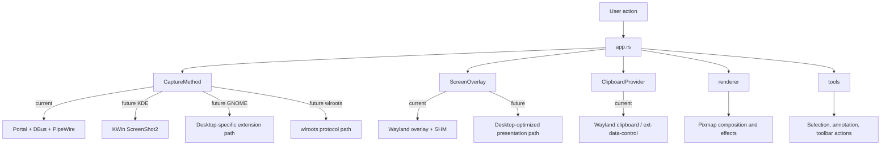

# LumineCapture

LumineCapture is a Wayland-native screenshot tool built with a KDE-first mindset: fast, lightweight, and designed to stay simple on the surface while keeping the internals flexible.

[Why this project exists](#why-this-project-exists)

> **Status:** this project is still in a very early WIP stage. The UI, capture pipeline, overlay behavior, save flow, and desktop-specific integrations are all expected to change before MVP and again before release.

## What it is

LumineCapture is not trying to be a generic "works everywhere, same everywhere" screenshot app.
Its direction is closer to:

- fast capture on Wayland
- KDE-native behavior as the primary target
- desktop-specific backends behind clean interfaces
- a small and practical editing flow for taking and finishing screenshots quickly

The current prototype already follows that idea: the app logic does not know how capture, overlay, or clipboard work internally. It only coordinates them.

## Quick Start

For now, the project is intentionally simple to run during development:

```bash
git clone https://github.com/Netflate/LumineCapture-wip
cd LumineCapture
cargo run --release
```

That is the current setup. It is not the final user-facing installation story.

### What will improve later

The long-term plan is to replace the current dev-only flow with proper packaging and easier system setup, especially for KDE users. The goal is to ship something closer to:

- RPM packages
- distro-friendly installation
- one-command setup for supported desktops
- less manual environment friction before first use

## Current State

This is the honest picture of the project right now.

| Area | Current state | Planned direction |
| --- | --- | --- |
| Capture | Wayland portal + DBus + PipeWire | KDE-native `org.kde.KWin.ScreenShot2` before MVP |
| Overlay | Wayland overlay with SHM surfaces | Faster and more desktop-aware rendering path |
| Clipboard | Wayland clipboard through `ext-data-control` | Refine reliability and lifecycle handling |
| Saving | Hardcoded file path and timestamp format | Configurable, disableable, user-friendly save options |
| UI | Functional prototype | Cleaner UI, better animations, better polish |
| Settings | Minimal / hardcoded | Proper configuration and flexibility |
| Packaging | `git clone` + `cargo run` | RPM and better installation flow |

### Current limitations

- Save path is hardcoded to a `Pictures/screenshots/...` pattern.
- Screenshots can overwrite each other if they are taken within the same minute.
- Saving cannot yet be disabled or customized.
- The overlay implementation is still tied to the current Wayland SHM approach.
- Some desktop-specific paths are still prototypes, not final decisions.

## Architecture

The main idea is to keep the application logic independent from the platform-specific details.



`app.rs` is the coordinator. It decides what to do next, but it does not own the backend details.

- `CaptureMethod` owns the screenshot acquisition logic.
- `ScreenOverlay` owns how the captured image is presented and updated.
- `ClipboardProvider` owns clipboard export.
- `renderer` handles image composition.
- `tools` handles editing interactions.

That separation matters because different desktops will need different implementations later without rewriting the whole app.

## Backend Strategy

The backend is intentionally staged.

### Right now

- Capture uses portal + DBus + PipeWire.
- Overlay is implemented through a Wayland SHM-based overlay.
- Clipboard export uses Wayland clipboard support.

### Before MVP

KDE is the main target.
The plan is to move capture toward native `org.kde.KWin.ScreenShot2` support before MVP, because that should remove extra middleware and make capture much faster and more direct.

### After MVP

Other desktops will get their own paths:

- GNOME via the relevant extension / desktop integration path
- wlroots-based desktops such as Hyprland and Sway via their protocols

Those backends matter, but they are not the core focus of the project.
The core focus is KDE.

## Workflow

A typical screenshot flow looks like this:

1. App starts capture.
2. Backend returns monitor frames.
3. `app.rs` builds pixmaps and initializes editor state.
4. Overlay is shown.
5. Mouse and keyboard events update selection, tools, toolbar, and magnifier.
6. The renderer repaints only the dirty areas.
7. Final screenshot is saved and/or copied to clipboard.

## Roadmap

### WIP to MVP

- Add tools like annotations, blur, and other basic screenshot editing actions.
- Rework screenshot presentation logic.
- Replace the current KDE capture path with a more native and faster solution.
- Polish the UI and animations.
- Add settings and user control for the save flow.
- Make installation and setup much easier, especially on KDE.

### Later

- Better packaging and distribution.
- Cleaner desktop detection and backend selection.
- More robust clipboard handling.
- Better persistence and configuration.
- Release-level polish.
  
## Setup Notes

If you want to run it locally today, the main requirement is a Wayland session with the expected desktop services available.

For KDE, the current flow should be as simple as:

```bash
cargo run --release
```

That said, the end goal is much better than that.
The project is supposed to become easy to install, easy to launch, and easy to trust on a fresh system.

## Why this project exists

The project is still early, so the current version is intentionally rough:

- capture is still built around portal + DBus + PipeWire
- the save flow is still hardcoded
- the overlay and UI still need more polish
- not every desktop gets the best possible path yet

That is temporary.
The plan is to keep the architecture flexible, move KDE to the fastest native path first, and then improve the rest of the desktop support after MVP without breaking the app structure.

